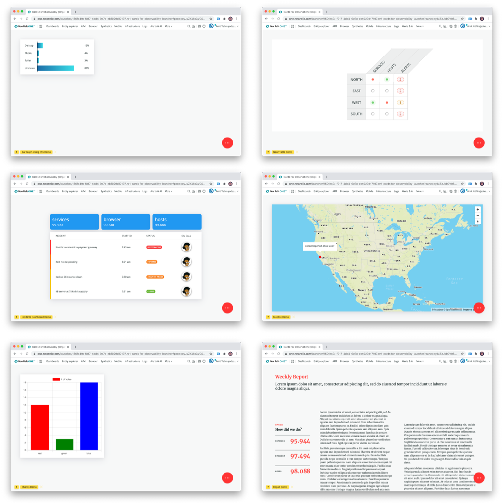

[](https://opensource.newrelic.com/oss-category/#new-relic-experimental)

[](https://github.com/newrelic-experimental/nr1-cards-for-observability/actions?query=workflow%3ACI) [](https://github.com/newrelic-experimental/nr1-cards-for-observability/releases) [](https://snyk.io/test/github/newrelic-experimental/nr1-cards-for-observability)

# Cards for Observability

Cards for Observability is an experimental take on building programmable dashboards in New Relic One. For the data, define queries which can be either NRQL, GraphQL, API or even a javascript object. To display the data in the dashboards, define cards by specifying the HTML and CSS for the cards.



## Getting started

1. Ensure that you have [Git](https://git-scm.com/book/en/v2/Getting-Started-Installing-Git) and [NPM](https://www.npmjs.com/get-npm) installed. If you're unsure whether you have one or both of them installed, run the following command. (If you have them installed these commands will return a version number, if not, the commands won't be recognized.)

   ```bash
   git --version
   npm -v
   ```

2. Install the [New Relic One CLI](https://one.newrelic.com/launcher/developer-center.launcher) by going to [this link](https://one.newrelic.com/launcher/developer-center.launcher) and following the instructions (5 minutes or less) to install and set up your New Relic development environment.

3. Run the following command to clone this repository and run the code locally against your New Relic data:

   ```bash
   nr1 nerdpack:clone -r https://github.com/newrelic-experimental/nr1-cards-for-observability.git
   cd nr1-cards-for-observability
   nr1 nerdpack:serve
   ```

Visit [https://one.newrelic.com/?nerdpacks=local](https://one.newrelic.com/?nerdpacks=local), navigate to the Nerdpack, and :sparkles:

## Deploying this Nerdpack

Open a command prompt in the Nerdpack's directory, and run the following commands.

```bash
# To create a new uuid for the nerdpack so that you can deploy it to your account:
# nr1 nerdpack:uuid -g [--profile=your_profile_name]

# To see a list of APIkeys / profiles available in your development environment:
# nr1 profiles:list

nr1 nerdpack:publish [--profile=your_profile_name]
nr1 nerdpack:deploy [-c [DEV|BETA|STABLE]] [--profile=your_profile_name]
nr1 nerdpack:subscribe [-c [DEV|BETA|STABLE]] [--profile=your_profile_name]
```

## Support

New Relic hosts and moderates an online forum where customers can interact with New Relic employees as well as other customers to get help and share best practices. Like all official New Relic open source projects, there's a related Community topic in the New Relic Explorers Hub. You can find this project's topic/threads here:

https://discuss.newrelic.com/c/build-on-new-relic/nerdpacks

## Contributing
We encourage your contributions to improve Cards for Observability! Keep in mind when you submit your pull request, you'll need to sign the CLA via the click-through using CLA-Assistant. You only have to sign the CLA one time per project.
If you have any questions, or to execute our corporate CLA, required if your contribution is on behalf of a company,  please drop us an email at opensource@newrelic.com.

## Security

As noted in our [security policy](https://github.com/newrelic-experimental/nr1-cards-for-observability/security/policy), New Relic is committed to the privacy and security of our customers and their data. We believe that providing coordinated disclosure by security researchers and engaging with the security community are important means to achieve our security goals.

If you believe you have found a security vulnerability in this project or any of New Relic's products or websites, we welcome and greatly appreciate you reporting it to New Relic through [HackerOne](https://hackerone.com/newrelic).

## License
Cards for Observability is licensed under the [Apache 2.0](http://apache.org/licenses/LICENSE-2.0.txt) License.

Cards for Observability also uses source code from third-party libraries. You can find full details on which libraries are used and the terms under which they are licensed in the [third-party notices](THIRD_PARTY_NOTICES.md) document.
